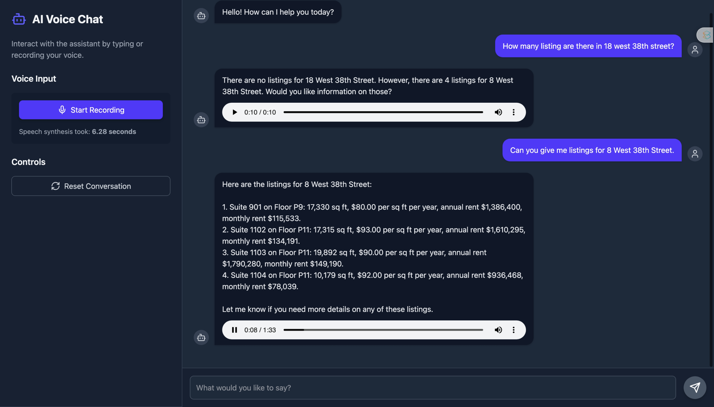

# Voice Conversational Agentic AI

The core problem is that valuable, proprietary information within an organization is often locked away in dense documents, making it difficult and slow to access. Employees typically have to rely on inefficient keyword searches or manually read through extensive texts to find specific answers. This project solves that by creating a seamless, voice-operated system. It allows a user to simply speak a question, which is then intelligently understood by an AI that can instantly retrieve precise information from those internal documents and deliver the answer back in a natural, spoken voice. Essentially, it transforms a static and cumbersome library of information into an interactive, expert conversationalist that's always available.

---

## Examples of Running the Application

### Example 1: Simple Data Fetch Query

Points to note:
- The user asks a straightforward question about the number of listings at a specific address.
- The system retrieves the relevant data from a structured database using Knowledge Graph RAG architecture.
- The AI provides a precise answer, demonstrating its ability to handle simple queries effectively.
- The STT and TTS components work seamlessly and their performance is displayed to provide a smooth user experience.

### Example 2: Fuzzy Matching with Entity Linking

Points to note:
- The user asks a question that requires understanding of multiple entities and their relationships.
- The system uses fuzzy matching to identify relevant rows, even if the query is not an exact match.
- The AI successfully links related entities to provide a comprehensive answer.
- The STT and TTS components maintain high performance throughout the interaction.

---

## From Smart Search to Knowledge Navigator

The architecture of a RAG system, how it "looks up" information—dramatically affects its capabilities. Let's explore how we evolved from simple RAG to more advanced, powerful designs to achieve better performance.

---

## 1. Standard RAG: The "Smart Search" 🧠

This is the most common type of RAG. It works by converting a library of documents (here rows) and the user's question into numerical representations called **vector embeddings**. It then finds the documents that are most semantically similar to the question and feeds them to the LLM as context.

-   **How it Works**: Imagine your data is a library of books. This RAG converts each paragraph into a unique "essence" (a vector). When you ask a question, it captures the "essence" of your query and finds the paragraphs with the most similar essence.
-   **Advantages**: It's relatively simple to set up and is excellent for question-answering over a collection of documents like PDFs, articles, or a knowledge base.

### The Limitation: The Counting Problem

Standard RAG is great at finding *what*, but not *how many*. It's designed to retrieve a fixed number of relevant text chunks, usually defined by a parameter called `top_k`.

-   **Failure Example**: Suppose you have 10 listings for "123 Main St" in your database and you ask the RAG, "**How many listings are at 123 Main St?**" If the system's `top_k` is set to 3, it will only retrieve the 3 most relevant listings. The LLM, seeing only these 3 documents, will confidently and **incorrectly** answer, "There are 3 listings at 123 Main St." It doesn't know about the other 7 because it never saw them.

---

## 2. SQL RAG: The "Data Analyst" 📊

To overcome the counting problem, we can give the AI a new tool: the ability to query a structured database, like one using SQL (Structured Query Language). This turns the AI from a simple searcher into a data analyst.

-   **How it Works**: When faced with a question, the LLM doesn't search for text; it writes and executes a SQL query. For the question above, it would generate: `SELECT COUNT(*) FROM listings WHERE address = '123 Main St'`. The database runs this query, returns the correct number (10), and the LLM provides the accurate answer.
-   **Advantages**: This architecture is perfect for structured data. It can perform precise calculations, aggregations, and filtering with near-perfect accuracy, solving the counting problem completely.

### The Limitations: Brittleness and Complex Relationships

This approach works beautifully as long as the questions are precise and the relationships are simple. It breaks down in two key areas:

#### A. Fuzzy Matching
Databases require exact matches. Human language is messy.

-   **Failure Example 1 (Fuzzy Matching)**: What if the database stores the address as "**15 W 38 St**" but the user asks, "**How many listings are at 15 west 38 street?**" The AI will generate the query `... WHERE address = '15 west 38 street'`, which will find **zero** results because the strings don't match perfectly. The system is too rigid to handle common variations.

#### B. Complex Relationships
As questions involve more connections between data, generating a single, correct SQL query becomes incredibly difficult for an LLM.

-   **Failure Example 2 (Complex Query)**: Consider the question: "**What is the phone number of the broker who manages the most expensive property on the same floor as the 'Tech Innovations Inc.' suite, and who are that broker's associates?**" A correct SQL query would require multiple complex `JOIN`s, subqueries, and ordering clauses. It's very easy for an LLM to make a mistake, join tables incorrectly, or miss a step, leading to a wrong answer or a query error.

---

## 3. Graph RAG: The "Knowledge Navigator" 🧭

This is the most powerful and flexible architecture. It stores data not in rigid tables but as a **knowledge graph**, a web of interconnected nodes (like 'Broker', 'Listing', 'Company') and relationships (like `MANAGES`, `WORKS_WITH`). This structure mirrors how we think about connections in the real world.

-   **How it Works**: This system uses a sophisticated two-step process to answer questions.
    1.  **Entity Linking (Fuzzy Search)**: First, it uses vector embeddings on specific fields (like the `address` column) to find the exact entity the user is asking about. When the user asks about "15 west 38 street," it uses semantic similarity to find the canonical entity in the database: the `Listing` node with the address "15 W 38 St."
    2.  **Structured Traversal (Graph Query)**: Once it has the exact starting node, it traverses the graph's relationships to answer the complex parts of the question. It moves from the `Listing` to the `Broker` who `MANAGES` it, finds their `Associates`, and retrieves the phone number.
-   **Advantages**: This hybrid approach combines the fuzzy-matching power of vector search with the precision of a structured database query.
    -   It **solves the fuzzy matching problem** by first identifying the correct entity before querying.
    -   It **solves the complex relationship problem** because traversing a graph ("go from this company -> to its floor -> find other listings on that floor -> find the broker") is a much more natural and less error-prone way for an AI to reason about connections than writing a monolithic SQL query.

By evolving our RAG architecture, we empower our AI to move beyond simple document search to become a true knowledge navigator, capable of answering nuanced, multi-part questions with both flexibility and precision.